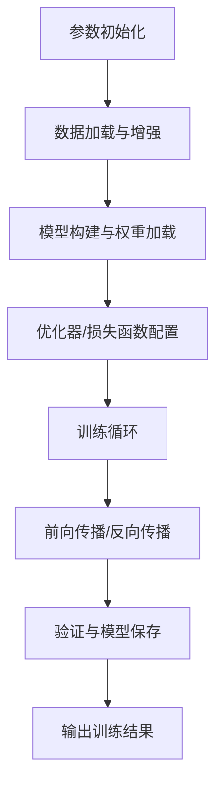

# 1-N实践yolov7目标检测算法-基于已有模型训练算法实现物体检测

## 1. 下载和熟悉yolov7项目结构

### 1.1 下载YOLOv7项目

#### 1.1.1 使用git拉取

在使用git拉取时，需要注意网络环境！

```bash
git clone https://github.com/WongKinYiu/yolov7.git
cd yolov7
```

**1、在安装目录输入cmd，直接进入终端**


**2、使用git指令从GitHub拉取**


#### 1.1.2 直接下载zip压缩包

[下载链接](https://github.com/WongKinYiu/yolov7)，解压到指定目录即可


### 1.2 搭建自己的yolov7项目结构

#### 1.2.1 原始项目结构


#### 1.2.2 自定义项目结构和代码

##### 1.2.2.1 整体项目文件

新手小白可能会疑惑，为什么下载下来还需要改项目结构？大佬的目标检测项目是通用的，可以用不同的方式来实现目标检测，但是万变不离其一！你需要根据自己的情况来自定义你的项目。比如，==在此教程中是给大家一个我用yolov7算法来实现水果检测的项目，后期可以结合springboot+vue等技术栈搭建自己的web项目（后期可能会出一个教程）==


首先，在整体的项目文件中：.engine和.pt文件先不用管，可以对照我的项目文件，把多余的删除！缺的补上！


##### 1.2.2.2 局部目录文件

- ./data目录下创建/fruit目录，在此目录下分别创建/images和/labels目录


- 在yolov7目录下创建weights目录，用于存放模型文件（不知道什么是模型文件的可以不用管）


- 去此链接上下载[yolov7模型文件](https://github.com/WongKinYiu/yolov7?tab=readme-ov-file)：yolov7.pt


下载完成后放到上面创建的weights目录下。


### 1.3 修改代码

#### 1.3.1 detect.py文件

此段代码是YOLOv7的推理（检测）核心实现，主要完成以下功能：

1. 加载训练好的模型权重（weights/yolov7.pt）
2. 处理输入源（图片/视频/摄像头）
3. 执行目标检测推理
4. 应用非极大值抑制（NMS）
5. 可视化结果并保存

只需要修改如下几个地方的代码：没有对应的目录可以不用管，也不用去创建目录！后面运行train.py会自动创建的


#### 1.3.2 partition_dataset.py文件

此文件是用来划分数据集的，可以直接使用该代码（==注意21、26和35行的图片路径换成你自己的路径==）

```python
# 划分数据集
import os
import random

def split_files(folder_path, ratio):
    # 获取文件夹中的文件列表
    file_list = os.listdir(folder_path)

    # 计算划分的文件数量
    total_files = len(file_list)
    num_files_part1 = int(total_files * ratio)
    num_files_part2 = total_files - num_files_part1

    # 随机划分文件
    random.shuffle(file_list)
    part1_files = file_list[:num_files_part1]
    part2_files = file_list[num_files_part1:]

    # 将划分结果写入 txt 文件
    with open("./data/fruit/train_list.txt", "w") as f:
        for filename in part1_files:
            abs_path = os.path.join(folder_path, filename)
            f.write(abs_path + "\n")

    with open("./data/fruit/val_list.txt", "w") as f:
        for filename in part2_files:
            abs_path = os.path.join(folder_path, filename)
            f.write(abs_path + "\n")

    print("Splitting files completed.")

if __name__ == "__main__":
    folder_path = r"W:\MingYi\programming project\Python\yolov7-main\data\fruit\images\potato1"  # 替换为实际的文件夹路径
    ratio = 0.9  # 指定训练部分的文件数量比例

    split_files(folder_path, ratio)
```


#### 1.3.3 coco.yaml文件

train、val键的值分别是：划分训练数据集的文档和验证数据集的文档，指定./data/fruit下即可！运行partition_dataset.py，会在该目录下自动创建这两个文件

```yaml
# train and val data as 1) directory: path/images/, 2) file: path/images.txt, or 3) list: [path1/images/, path2/images/]
train: ./data/fruit/train_list.txt
val: ./data/fruit/val_list.txt
# number of classes
nc: 1

# class names
names: ['potato']
```

```
nc---有几种类别
names---类名
```

如下图：


==没有创建这两个文件先不用管，因为还没有配置python环境，代码跑不起来也正常！==只需要照上述说的做即可。

 

#### 1.3.4 infer.py文件

基于 **TensorRT 加速的 YOLOv7 目标检测系统**，主要功能是通过加载预训练好的 TensorRT 引擎文件（`.engine`），对图片或摄像头实时画面进行高效的目标检测。直接复制粘贴即可，不知道代码是干嘛的可以问AI来解答。后续通过TensorRT将.pt权重文件转为.engine引擎文件

```python
import cv2
import tensorrt as trt
import torch
import numpy as np
from collections import OrderedDict, namedtuple


class TRT_engine():
    def __init__(self, weight) -> None:
        self.imgsz = [640, 640]
        self.weight = weight
        self.device = torch.device('cuda:0')
        self.init_engine()

    def init_engine(self):
        # Infer TensorRT Engine
        self.Binding = namedtuple('Binding', ('name', 'dtype', 'shape', 'data', 'ptr'))
        self.logger = trt.Logger(trt.Logger.INFO)
        trt.init_libnvinfer_plugins(self.logger, namespace="")
        with open(self.weight, 'rb') as self.f, trt.Runtime(self.logger) as self.runtime:
            self.model = self.runtime.deserialize_cuda_engine(self.f.read())
        self.bindings = OrderedDict()
        self.fp16 = False

        print("Available TensorRT Bindings:")
        for index in range(self.model.num_bindings):
            self.name = self.model.get_tensor_name(index)  # 使用新 API
            self.dtype = trt.nptype(self.model.get_binding_dtype(index))
            self.shape = tuple(self.model.get_binding_shape(index))
            self.data = torch.from_numpy(np.empty(self.shape, dtype=np.dtype(self.dtype))).to(self.device)
            self.bindings[self.name] = self.Binding(self.name, self.dtype, self.shape, self.data,
                                                    int(self.data.data_ptr()))
            if self.model.binding_is_input(index) and self.dtype == np.float16:
                self.fp16 = True
            print(f"  {index}: {self.name} -> shape={self.shape}, dtype={self.dtype}")

        self.binding_addrs = OrderedDict((n, d.ptr) for n, d in self.bindings.items())
        self.context = self.model.create_execution_context()

    def preprocess(self, image):
        # 检查图像是否为空
        if image is None:
            raise ValueError("图像加载失败，请检查路径是否正确。")

        img = cv2.resize(image, (640, 640))
        img = img.transpose((2, 0, 1))
        img = np.expand_dims(img, 0)
        img = np.ascontiguousarray(img)
        img = torch.from_numpy(img).to(self.device)
        img = img.float()
        return img

    def predict(self, img, threshold):
        img = self.preprocess(img)
        self.binding_addrs['images'] = int(img.data_ptr())
        self.context.execute_v2(list(self.binding_addrs.values()))

        # 获取输出结果
        output = self.bindings['output'].data.cpu().numpy()  # 转为 NumPy 数组

        # 解析 YOLOv7 输出
        batch, num_anchors, grid_h, grid_w, num_attrs = output.shape  # (1, 3, 80, 80, 6)
        detections = output.reshape(-1, 6)  # 转成 (N, 6) 形式

        new_bboxes = []
        for det in detections:
            x, y, w, h, conf, cls = det

            # 如果存在 NaN 或者置信度低于阈值，则跳过该框
            if np.any(np.isnan(det)) or conf < threshold:
                continue

            # 转换 bbox 形式 (cx, cy, w, h) -> (xmin, ymin, xmax, ymax)
            xmin = (x - w / 2)
            ymin = (y - h / 2)
            xmax = (x + w / 2)
            ymax = (y + h / 2)

            new_bboxes.append([cls, conf, xmin, ymin, xmax, ymax])

        return new_bboxes


def visualize(img, bbox_array):
    for temp in bbox_array:
        xmin, ymin, xmax, ymax = map(int, temp[2:6])

        # 检查坐标是否合法
        if xmin < 0 or ymin < 0 or xmax < 0 or ymax < 0:
            continue  # 跳过无效的框

        clas = int(temp[0])
        score = temp[1]
        cv2.rectangle(img, (xmin, ymin), (xmax, ymax), (105, 237, 249), 2)
        img = cv2.putText(img, f"class:{clas} {round(score, 2)}", (xmin, ymin - 5),
                          cv2.FONT_HERSHEY_SIMPLEX, 0.5, (105, 237, 249), 1)
    return img


def process_image(img_path, trt_engine):
    img = cv2.imread(img_path)
    if img is None:
        print(f"无法读取图像文件: {img_path}")
        return
    results = trt_engine.predict(img, threshold=0.5)
    img = visualize(img, results)
    cv2.imshow("img", img)
    cv2.waitKey(0)
    cv2.destroyAllWindows()


# 用户输入选择
print("选择模式：输入 1 预测单张图片，输入 2 进行摄像头实时检测: ")
mode = input()

trt_engine = TRT_engine("./best_fp16.engine")

if mode == "1":
    img_path = input("请输入图片路径: ")
    process_image(img_path, trt_engine)
elif mode == "2":
    cap = cv2.VideoCapture(0)
    while True:
        ret, frame = cap.read()
        if not ret:
            break

        results = trt_engine.predict(frame, threshold=0.5)
        frame = visualize(frame, results)

        cv2.imshow("Camera", frame)

        if cv2.waitKey(1) & 0xFF == ord('q'):
            break

    cap.release()
    cv2.destroyAllWindows()
```


#### 1.3.5 test.py文件

.pt权重文件的路径先不用管，运行train.py会自动创建改目录结构的！


#### 1.3.6 train.py文件

参数做参考，batch-size参数是指GPU显存大小（我的是4G的，指定为2）代码有不懂的地方直接问AI。


## 2. 项目结构分析

### 2.1 核心目录

#### cfg/目录

包含了各种模型配置文件：
- deploy/：部署相关的配置文件
- yolov7.yaml：标准YOLOv7模型配置
- yolov7-tiny.yaml：轻量级模型配置
- yolov7x.yaml：更大规模的模型配置
- training/：训练相关的配置文件

#### models/目录

- common.py：基础网络模块
- experimental.py：实验性网络模块
- yolo.py：YOLO模型的核心实现

#### utils/目录
- datasets.py：数据集加载和预处理
- general.py：通用工具函数
- torch_utils.py：PyTorch相关工具函数
- plots.py：可视化工具
- metrics.py：评估指标计算

### 2.2 核心文件

#### train.py
训练脚本，主要功能：
- 加载数据集和模型配置
- 初始化模型和优化器
- 训练循环和验证
- 保存检查点

主要参数：
```bash
python train.py --data data/coco.yaml --cfg cfg/training/yolov7.yaml --weights '' --batch-size 32
```

#### detect.py

目标检测脚本，主要功能：
- 加载预训练模型
- 图像预处理
- 目标检测和后处理
- 结果可视化

主要参数：
```bash
python detect.py --weights weights/yolov7.pt --source images/
```

#### test.py
测试脚本，用于评估模型性能：
- 加载测试数据集
- 运行推理
- 计算评估指标

#### export.py


## 3. 核心代码解析

### 3.1 detect.py解析

1. 参数配置
```python
parser.add_argument('--weights', type=str, default='runs/train/exp/weights/best.pt', help='模型权重路径')
parser.add_argument('--source', type=str, default='data/fruit/images/test', help='图像/视频源')
parser.add_argument('--img-size', type=int, default=640, help='推理尺寸')
parser.add_argument('--conf-thres', type=float, default=0.25, help='置信度阈值')
parser.add_argument('--iou-thres', type=float, default=0.45, help='NMS IOU阈值')
```

2. 模型加载
```python
model = attempt_load(weights, map_location=device)  # 加载FP32模型
stride = int(model.stride.max())  # 获取模型步长
imgsz = check_img_size(imgsz, s=stride)  # 检查图像尺寸
```

3. 数据加载
```python
if webcam:
    dataset = LoadStreams(source, img_size=imgsz, stride=stride)
else:
    dataset = LoadImages(source, img_size=imgsz, stride=stride)
```

4. 推理过程
```python
img = torch.from_numpy(img).to(device)
img = img.half() if half else img.float()
img /= 255.0
pred = model(img, augment=opt.augment)[0]
pred = non_max_suppression(pred, opt.conf_thres, opt.iou_thres)
```

以下是针对 `train.py` 的详细解析，结合代码结构和实际训练流程进行模块化说明：

---

### **3.2 train.py 解析**

#### **1. 参数配置与初始化**

```python
# 关键参数示例（简化版）
parser.add_argument('--weights', type=str, default='weights/yolov7.pt', help='预训练权重路径')
parser.add_argument('--cfg', type=str, default='models/yolov7.yaml', help='模型配置文件')
parser.add_argument('--data', type=str, default='data/coco.yaml', help='数据集配置文件')
parser.add_argument('--hyp', type=str, default='data/hyp.scratch.p5.yaml', help='超参数文件')
parser.add_argument('--epochs', type=int, default=300, help='训练总轮次')
parser.add_argument('--batch-size', type=int, default=32, help='批量大小')
parser.add_argument('--img-size', nargs='+', type=int, default=[640, 640], help='[训练, 测试] 图像尺寸')
parser.add_argument('--device', default='0', help='GPU设备编号')
```

---

#### **2. 数据准备**
##### **2.1 数据配置加载**

```python
with open(opt.data) as f:
    data_dict = yaml.safe_load(f)  # 从YAML加载数据集配置
train_path = data_dict['train']    # 训练集路径
val_path = data_dict['val']        # 验证集路径
nc = int(data_dict['nc'])          # 类别数
names = data_dict['names']         # 类别名称
```

##### **2.2 数据增强设置**
通过 `hyp.yaml` 文件配置增强参数：
```yaml
# hyp.yaml 示例
hsv_h: 0.015  # 色调增强幅度
hsv_s: 0.7    # 饱和度增强幅度
flipud: 0.5   # 上下翻转概率
mosaic: 1.0   # Mosaic增强概率
```

##### **2.3 数据加载器**
```python
train_loader = create_dataloader(
    train_path, 
    imgsz=opt.img_size[0], 
    batch_size=opt.batch_size,
    augment=True,                  # 启用增强
    hyp=hyp,                      # 超参数
    rect=opt.rect,                 # 矩形训练
    cache=opt.cache_images         # 缓存图像
)[0]
```

---

#### **3. 模型构建**
##### **3.1 模型初始化**
```python
model = Model(opt.cfg, ch=3, nc=nc, anchors=hyp.get('anchors')).to(device)
if opt.weights.endswith('.pt'):
    ckpt = torch.load(opt.weights, map_location=device)
    model.load_state_dict(ckpt['model'].float().state_dict())  # 加载预训练权重
```

##### **3.2 冻结层（可选）**
```python
freeze = [f'model.{x}.' for x in range(5)]  # 冻结前5层
for k, v in model.named_parameters():
    if any(x in k for x in freeze):
        v.requires_grad = False  # 冻结梯度
```

---

#### **4. 训练配置**
##### **4.1 优化器设置**
```python
# 参数分组（权重、偏置、BN层）
pg0 = [p for n, p in model.named_parameters() if 'bias' in n]
pg1 = [p for n, p in model.named_parameters() if 'weight' in n and 'bn' not in n]
optimizer = optim.SGD(pg0, lr=hyp['lr0'], momentum=hyp['momentum'])
optimizer.add_param_group({'params': pg1, 'weight_decay': hyp['weight_decay']})
```

##### **4.2 学习率调度**
```python
lf = lambda x: (1 - x / epochs) * (1.0 - hyp['lrf']) + hyp['lrf']  # 线性衰减
scheduler = lr_scheduler.LambdaLR(optimizer, lr_lambda=lf)
```

##### **4.3 损失函数**
```python
compute_loss = ComputeLoss(model, hyp)  # 包含分类/回归/目标损失
```

---

#### **5. 训练循环**
##### **5.1 单批次训练流程**
```python
for epoch in range(epochs):
    for i, (imgs, targets, _, _) in enumerate(train_loader):
        imgs = imgs.to(device).float() / 255.0
        
        # 前向传播
        pred = model(imgs)
        loss, loss_items = compute_loss(pred, targets.to(device))
        
        # 反向传播
        scaler.scale(loss).backward()
        if ni % accumulate == 0:
            scaler.step(optimizer)
            scaler.update()
            optimizer.zero_grad()
        
        # 日志记录
        mloss = (mloss * i + loss_items) / (i + 1)
```

##### **5.2 验证与保存**
```python
if epoch % opt.eval_interval == 0:
    results = test.test(opt.data, model=ema.ema, dataloader=val_loader)
    fitness = results[2]  # mAP@0.5
    
    # 保存最佳模型
    if fitness > best_fitness:
        torch.save(ckpt, 'best.pt')
```

---

#### **6. 关键技术与优化**
1. **EMA (指数移动平均)**  
   ```python
   ema = ModelEMA(model)  # 平滑模型参数，提升泛化性
   ```
2. **混合精度训练**  
   ```python
   scaler = amp.GradScaler(enabled=cuda)  # 加速训练，减少显存占用
   ```
3. **多尺度训练**  
   ```python
   if opt.multi_scale:
       img_size = random.randrange(imgsz * 0.5, imgsz * 1.5 + gs) // gs * gs
   ```
4. **自动锚框调整**  
   ```python
   if not opt.noautoanchor:
       check_anchors(dataset, model=model, thr=hyp['anchor_t'])
   ```

---

#### **7. 输出与日志**
- **训练日志示例**  
  ```
  Epoch   GPU_mem   box_loss   obj_loss   cls_loss   total   targets
  0/299     3.2G      0.123      0.456      0.078     0.657       32
  ```
- **结果保存**  
  - `runs/train/exp/weights/best.pt`：最佳模型
  - `runs/train/exp/results.txt`：训练指标记录

---

### 3.3 test.py解析

1. 参数配置

```python
parser.add_argument('--weights', type=str, default='', help='模型权重路径')
parser.add_argument('--data', type=str, default='data/coco.yaml', help='数据集配置文件路径')
parser.add_argument('--batch-size', type=int,default=32, help='批量大小')
parser.add_argument('--img-size', type=int, default=640, help='推理尺寸')
parser.add_argument('--conf-thres', type=float, default=0.001, help='置信度阈值')
parser.add_argument('--iou-thres', type=float, default=0.65, help='NMS IOU阈值')
parser.add_argument('--task', default='val', help='val, test或speed')
parser.add_argument('--device', default='', help='cuda设备，如0或0,1,2,3')
```

2. 模型加载与准备

```python
model = attempt_load(weights, map_location=device)  # 加载FP32模型
imgsz = check_img_size(imgsz, s=model.stride.max())  # 检查图像尺寸
if half:
    model.half()  # 转为FP16推理
```

3. 数据加载器初始化

```python
dataloader = create_dataloader(data[task], 
                             imgsz, 
                             batch_size, 
                             model.stride.max(), 
                             opt, 
                             pad=0.5, 
                             rect=True)[0]
```

4. 测试流程

```python
for batch_i, (img, targets, paths, shapes) in enumerate(tqdm(dataloader)):
    img = img.to(device, non_blocking=True)
    img = img.half() if half else img.float()
    img /= 255.0
    
    # 推理
    out, train_out = model(img, augment=augment)
    
    # NMS处理
    out = non_max_suppression(out, conf_thres, iou_thres)
    
    # 统计指标
    stats = process_batch(out, targets, iouv)
```

5. 结果计算与输出

```python
# 计算mAP
mp, mr, map50, map = ap_per_class(*stats)
# 打印结果
print_results(mp, mr, map50, map, names)
```

### 3.4 export.py解析

1. 参数配置

```python
parser.add_argument('--weights', type=str, default='./runs/train/best.pt', help='模型权重路径')
parser.add_argument('--img-size', nargs='+', type=int, default=[640,640], help='输入图像尺寸')
parser.add_argument('--batch-size', type=int, default=1, help='批量大小')
parser.add_argument('--device', default='0', help='导出设备')
parser.add_argument('--format', type=str, default='onnx', help='导出格式: onnx, torchscript')
parser.add_argument('--simplify', action='store_true', help='简化ONNX模型')
parser.add_argument('--dynamic', action='store_true', help='动态输入/输出维度')
```

2. 模型加载与检查

```python
model = attempt_load(weights, map_location=device)  # 加载FP32模型
model.eval()
for k, m in model.named_modules():
    if hasattr(m, 'convert'):
        m.convert = convert  # 转换自定义层
```

3. 输入示例准备

```python
img = torch.zeros(batch_size, 3, *img_size).to(device)  # 创建虚拟输入
```

4. 模型导出

```python
if format == 'onnx':
    torch.onnx.export(
        model,  # 模型
        img,  # 输入示例
        f,  # 输出文件
        verbose=False,
        opset_version=12,
        input_names=['images'],
        output_names=['output'],
        dynamic_axes=dynamic_axes if dynamic else None
    )
    
    # 简化ONNX模型
    if simplify:
        simplify_onnx(f)
        
elif format == 'torchscript':
    model_ts = torch.jit.trace(model, img, strict=False)
    model_ts.save(f)
```

5. 导出后验证

```python
# 验证导出模型
if format == 'onnx':
    check_onnx(f)  # 检查ONNX模型有效性
    
print(f'Export complete. Results saved to {f}')
```

### 3.5 各模块核心功能对比

| 模块      | 核心功能                                         | 关键参数                                               |
| --------- | ------------------------------------------------ | ------------------------------------------------------ |
| detect.py | 单张图像/视频流的目标检测                        | weights, source, conf-thres, iou-thres                 |
| train.py  | 模型训练，包括数据准备、模型优化、训练循环和验证 | weights, cfg, data, epochs, batch-size, hyp            |
| test.py   | 模型性能评估，计算mAP等指标                      | weights, data, batch-size, task, conf-thres, iou-thres |
| export.py | 模型格式转换，支持ONNX/TorchScript等格式导出     | weights, img-size, batch-size, format, dynamic         |

### 3.6 总结-流程图




## 4. 环境搭建

### 4.1 安装python环境

[使用anaconda安装python环境](https://blog.csdn.net/qq_44000789/article/details/142214660)

安装完成后，配置系统环境变量：


```bash
conda -V # 查看是否成功
```

### 4.2 使用GPU还是CPU训练？

1. Nvidia显卡支持使用GPU训练，但是需要安装cuda和cudnn
2. AMD和intel显卡目前只能用CPU训练


### 4.3 GPU训练模型

#### 4.3.1 安装配置cuda和cudnn

[cuda下载链接](https://developer.nvidia.com/cuda-downloads)


下载完成后，直接运行.exe默认安装，配置系统环境变量：


```bash
nvcc -V # 检查NVIDIA CUDA编译器（nvcc）的版本
nvidia-smi # 监控和管理NVIDIA GPU设备的工具包
```


==注意这里的cuda版本选择==：先去[pytorch官网](https://pytorch.org/)查看支持哪几个版本的cuda，如下：


**选择和pytorch对应的cuda版本下载即可**

[cuda安装和配置](https://blog.csdn.net/Evan_qin_yi_quan/article/details/129444568)

[cudnn安装和配置](https://blog.csdn.net/Evan_qin_yi_quan/article/details/129444568)

注意：cudnn的版本要和cuda一致！


将下载的cudnn文件解压到cuda的安装目录：C:\Program Files\NVIDIA GPU Computing Toolkit\CUDA\v11.8，选择替换


#### 4.3.2 创建conda环境

- Win+R打开Windows终端创建名为yolov7的conda环境，指定python版本3.10：

  ```bash
  conda create -n yolov7 python=3.10
  ```

- 激活创建的环境：

  ```bash
  conda activate yolov7
  ```


- 首先进入终端，路径为yolov7的项目路径，然后激活创建环境，安装requirements.txt文档中的依赖：因为requirements.txt在yolov7目录下，将文档中的依赖安装到已创建的conda环境中。

  ```bash
  pip install -i https://pypi.mirrors.ustc.edu.cn/simple/ -r requirements.txt # 安装项目所需的依赖
  ```


检测torch能否调用cuda：

如果是像如下显示False，说明：==cuda版本和torch版本不匹配导致的！==你需要回到上面的cuda安装：详细阅读要求（cuda版本和pytorch版本一致！）

**==注==：使用exit()来退出当前的python环境**


```python
import torch
torch.cuda.is_available()
```

首先删除原先的pytorch：pip uninstall pytorch torch torchvision torchaudio -y 然后在你的conda环境中重新安装：

```bash
pip3 install torch torchvision torchaudio --index-url https://download.pytorch.org/whl/cu118
```


再次检查：返回True即可


### 4.4 CPU训练模型

除了不用下载cuda和cudnn意外，步骤2：创建conda环境，都是一样的。


### 4.5 ==数据标注工具labelimg==

先退出当前环境：

```cmd
conda deactivate
```


重新创建labelimg环境：**我试了一下这里的python版本3.6最稳定（如果是3.10使用该工具时会出现闪退！）**

```cmd
conda create -n yolov7 python=3.6
```


在当前labelimg环境中开启labelimg：会进入labelimg的UI界面

```cmd
labelimg
```


在View处打开Auto Save Mode，这样每标完一张图片就自动保存该图片的label标签！每一张图片对应一个label标签，TXT文件保存的是图片的物体类别和对应的坐标。


TXT的文件信息：


**classes.txt**：


最后将/images和/labels放到yolov7/data/fruit目录下！


分别指定partition_dataset.py和coco.yaml中的图片路径参数、类别信息：


**coco.yaml：**


看到这里！你是不是已经懂前面的：**1.下载和熟悉yolov7项目结构**。如果还是很懵，再回去多看几遍。

train_list.txt：其实就是数据图片的路径信息


### 4.6 IDE中使用conda环境

在PyCharm中打开yolov7项目：


在IDE右下角选择"添加本地解释器"，选择yolov7环境：


**上述操作完成后，等待IDE加载环境！**


## 5. 运行train.py训练模型

在完成上述所有步骤后，直接运行train.py

报错：


说明**上次的数据划分文件**还存在，你需要先删除：


先运行partition_dataset.py，再运行train.py


训练完成会在/runs/train/exp/weights目录下生成best.pt权重文件！


## 6. 运行detect.py识别

在detect.py中指定识别图片的路径和已经训练完成的权重文件！


**结果**


##  7. 运行test.py测试

指定权重文件路径即可！


## 8. 引入TensorRT

TensorRT（**Tensor Runtime**）是**NVIDIA推出的高性能深度学习推理（Inference）优化库**，专为加速神经网络在NVIDIA GPU（如 Tesla、GeForce、Jetson 等）上的推理任务而设计。


### 8.1 介绍

#### 1. 核心功能

TensorRT 的核心目标是通过多种优化技术，**最大化 GPU 的推理性能**，主要优化手段包括：
- **层融合（Layer Fusion）**：合并多个计算层，减少内存访问和计算开销。
- **精度校准（Precision Calibration）**：支持 **FP32、FP16、INT8** 量化，提升计算速度并降低显存占用。
- **内核自动调优（Kernel Auto-Tuning）**：为不同 GPU 架构选择最优计算方式。
- **动态张量内存管理**：高效管理显存，减少内存碎片。
- **图优化（Graph Optimization）**：优化计算图结构，减少冗余计算。

---

#### 2. 主要用途

TensorRT 主要用于 **推理（Inference）阶段**，即模型训练完成后，在实际部署时加速预测任务。典型应用场景包括：
- **计算机视觉（CV）**：目标检测（YOLO、Faster R-CNN）、图像分类（ResNet、EfficientNet）、语义分割（UNet）
- **自然语言处理（NLP）**：BERT、GPT 等大语言模型的推理加速
- **自动驾驶**：实时物体检测、车道线识别、传感器融合
- **医疗影像分析**：CT/MRI 图像的快速推理
- **机器人 & 边缘计算**：Jetson 设备上的低延迟推理

---

#### 3. 工作流程

TensorRT 通常与 **PyTorch、TensorFlow、ONNX** 等框架配合使用，典型流程如下：
1. **训练模型**：使用 PyTorch/TensorFlow 训练神经网络
2. **导出模型**：转换为 ONNX 或 TensorRT 支持的格式
3. **优化模型**：TensorRT 解析 ONNX 模型并进行优化
4. **部署推理**：在 GPU 上运行优化后的 TensorRT 引擎


#### 4. 支持的框架与格式

TensorRT 可以与多种深度学习框架集成：
| 框架/格式      | 说明                                               |
| -------------- | -------------------------------------------------- |
| **ONNX**       | 通用模型交换格式（PyTorch/TensorFlow 可导出 ONNX） |
| **PyTorch**    | 通过 `torch2trt` 或 `torch.onnx.export` 转换       |
| **TensorFlow** | 通过 `tf2onnx` 或 TensorFlow-TensorRT 集成         |
| **Caffe**      | 直接支持（但 Caffe 已逐渐淘汰）                    |

---

#### 5. 性能优势

| 优化方式            | 典型加速比 | 适用场景                                       |
| ------------------- | ---------- | ---------------------------------------------- |
| **FP32 → FP16**     | 1.5-3x     | 适用于大多数 GPU（如 Tesla V100、A100）        |
| **FP32 → INT8**     | 3-5x       | 需要量化校准（适用于 Jetson、T4 等低功耗 GPU） |
| **层融合 + 图优化** | 1.2-2x     | 减少计算和内存开销                             |


### 8.2 下载配置

[NVIDIA TensorRT 8.x Download](https://developer.nvidia.com/nvidia-tensorrt-8x-download)


下载完成后，解压缩并配置**系统环境变量**：


然后将：

TensorRT-8.6.1.6\include中的文件复制到C:\Program Files\NVIDIA GPU Computing Toolkit\CUDA\v11.8\include

TensorRT-8.6.1.6\lib 中的所有**.lib**文件复制 到C:\Program Files\NVIDIA GPU Computing Toolkit\CUDA\v11.8\lib\x64

TensorRT-8.6.1.6\lib 中的所有**.dll文件**复制到C:\Program Files\NVIDIA GPU Computing Toolkit\CUDA\v11.8\bin


在你的**yolov7环境**中分别安装**TensorRT-8.6.1.6**下uff、python、onnx_graphsurgeor包中的**.whl**文件：

```bash
pip install *.whl # *号需要换成具体安装的文件名
```


例如，安装uff下的uff-0.6.9-py2.py3-none-any.whl：


注意：python中需要安装的.whl文件有3个！请根据你的yolov7环境中的python版本选择安装！我的python版本是3.10：


### 8.3 .onnx转.engine

直接运行export.py文件，将best.pt转为best.onnx：


将best.onnx文件复制到**TensorRT-8.6.1.6\bin**目录下：


在当前/bin目录下进入终端和你的yolov7环境中，使用TensorRT的trtexec.exe工具将.onnx转成.engine：

```bash
trtexec --onnx=./best.onnx --saveEngine=./best_fp16.engine --fp16 --workspace=200
```


转换成功后，会在/bin目录下生成对应的.engine文件：


### 8.4 使用.engine进行目标检测

将该.engine文件复制到yolov7目录下（和export.py同级），然后运行infer.py使用.engine文件来进行**目标检测和识别**：

```yaml
模式选择：
1、选择指定图片识别
2、开启摄像头实时识别
```


这里没有标注框显示，我猜测可能是训练数据集太小了
